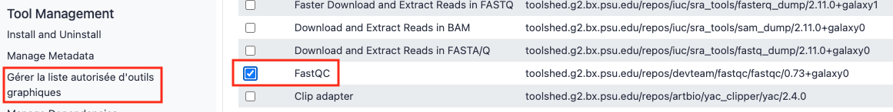
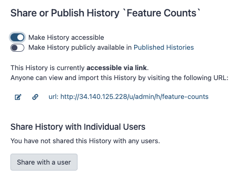
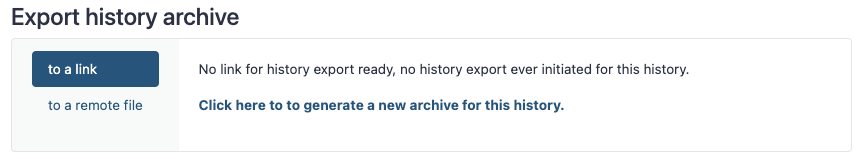
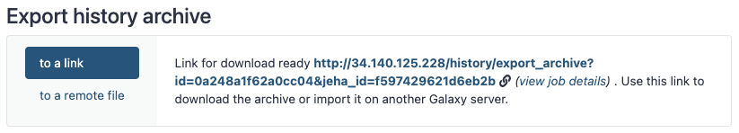
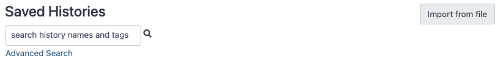

# 4. Annexes

Cette page regroupe différentes solutions utilisées dans Galaxy au cours des travaux pratiques 

--------------------------------------------------------------------------------
## Commandes du programme screen

Screen est un programme linux utile qui crée, attache, détache ou rattache des sessions shell "virtuelles". Screen permet d'exécuter des processus linux simultanés dans des environnements isolés qui peuvent être mis en arrière-plan tout en travaillant avec la console à d'autres tâches.

Commandes utiles :

- `screen -ls` liste toutes les sessions screen disponibles, attachées (actuellement actives) ou détachées en arrière-plan ;
- `screen -r <session>` rattache une session écran détachée ;
- `CtrlA puis D` détache la session active ;
- Tapez `exit` pour mettre fin à la session active ;
- `screen -S <session>` crée une nouvelle session.

--------------------------------------------------------------------------------
## Gestion du serveur Galaxy

- `galaxyctl status` donne l'état du serveur galaxy ;
- `galaxyctl start` si d'aventure le serveur galaxy est arrêté, mais cela ne devrait pas arriver ;
- `galaxyctl stop` pour arrêter le serveur, mais il n'y a en principe pas de raison de le faire ;
- `galaxyctl restart` pour redémarrer le serveur, utile si besoin de mettre à jour des références, des changements de préférence, etc. 

Au redémarrage d'une machine virtuelle (VM) suspendue, on retrouve Galaxy dans l'état où il était lors de sa suspension. À noter cependant que si on suspend la VM au milieu d'un job Galaxy en exécution cela mettra le job en question en erreur.

--------------------------------------------------------------------------------
## Modifier le type des données

Il peut arriver qu'un fichier, pourtant présent dans votre historique, ne soit pas visible en entrée d'un outil Galaxy. Par exemple il peut arriver que le fichier fastq que vous avez chargé dans votre historique n’apparait pas comme disponible dans l’outil Bowtie.

Pour régler ce problème, vous devez réaliser une conversion du type de fichier. L’outil attend un fichier au format fastqsanger et il est pour le moment seulement fastq.gz. 

Pour changer le type d’un fichier, il faut cliquer sur l’icône en forme de crayon. Puis aller dans l’onglet « Datatype ».

Dans le menu déroulant remplacer « fastq.gz », le type actuel, par « fastqsanger.gz ». Puis cliquer sur "Changer le format des données"

--------------------------------------------------------------------------------
## Résoudre les problèmes d'affichage HTML dans Galaxy

Il est possible que les sorties de certains outils ne s'affichent pas dans Galaxy comme par exemple FastQC.

Pour les afficher il faut les autoriser spécifiquement :

1. Aller dans le menu "Admin"
2. Dans le menu de gauche, dans la partie "Tool Management", choisir "Manage Allowlist"
3. Rechercher "FastQC" dans la liste, cliquer sur n'importe quelle case de la ligne. Elle va disparaître et s'afficher dans l'onglet "HTML Rendered"

Ce système protège l'injection de code dans les pages HTML.

--------------------------------------------------------------------------------
## Copier des fichiers entre histoires

Pour utiliser dans votre histoire actuel un fichier situé dans un autre histoire il faut procéder de la façon suivante :

1. Choisir "Copier les jeux de données" depuis le menu "roue crantée" en haut à droite
2. Sélectionner les fichiers qui vous intéressent depuis l'histoire source vers l'histoire de destination, vous pouvez aussi indiquer le nom d'une nouvelle histoire
3. Cliquez sur "Copy History Items"

--------------------------------------------------------------------------------
## Partage de fichiers dans Galaxy

Pour partager un historique, il faut tout d'abord sélectionner « Partager et Publier » dans le menu de la roue crantée en haut à droite puis choisir « Make History Accessible ».

Retournez de nouveau dans le menu de la roue crantée et cliquer sur « Exporter l’historique dans un fichier » dans le sous-menu « Télécharger ». Choisir "to a link" et cliquer sur "Click here to to generate a new archive for this history".

Il faut alors cliquer sur le lien qui s'affiche dans la partie centrale pour récupérer l'archive de l'historique (.tar.gz) en local.

Pour importer un historique partagé, allez dans le menu "User" puis choisir "Histories". Cliquer sur "Import from file".

Sélectionnez "Upload local file from your computer", cliquez sur "Browse" pour choisir l'emplacement du fichier puis sur "Import history".

Une fois importé, pensez à le renommer pour lui donner un nom plus explicite.

