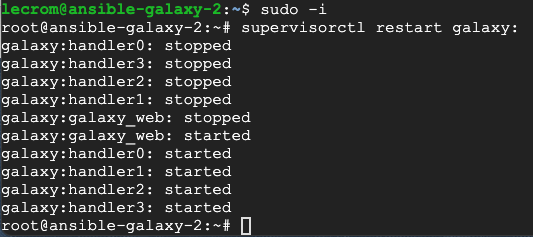
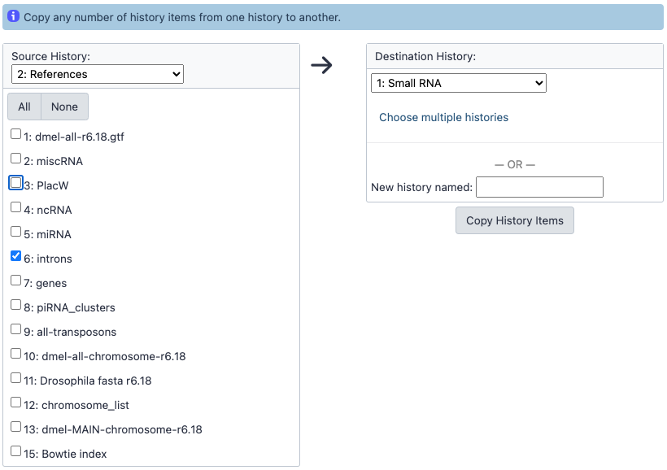

# 4. Annexes

Cette page regroupe différentes solutions utilisées dans Galaxy au cours des travaux pratiques 

--------------------------------------------------------------------------------
## L'outil ne s'affiche pas dans le menu

Il arrive que l'outil que l'on veut utiliser dans Galaxy ne s'affiche pas. Pour cela il faut relancer le serveur Galaxy. Cela s'effectue dans la console après être passé en mode "root" avec le code suivant :

`supervisorctl restart galaxy:`

--------------------------------------------------------------------------------
## Modifier le type des données

Il peut arriver qu'un fichier, pourtant présent dans votre historique, ne soit pas visible en entrée d'un outil Galaxy. Par exemple il peut arriver que le fichier fastq que vous avez chargé dans votre historique n’apparait pas comme disponible dans l’outil Bowtie.

Pour régler ce problème, vous devez réaliser une conversion du type de fichier. L’outil attend un fichier au format fastqsanger et il est pour le moment seulement fastq.gz. 

Pour changer le type d’un fichier, il faut cliquer sur l’icône en forme de crayon. Puis aller dans l’onglet « Datatype ».

Dans le menu déroulant remplacer « fastq.gz », le type actuel, par « fastqsanger.gz ». Puis cliquer sur "Changer le format des données"

--------------------------------------------------------------------------------
## Résoudre les problèmes d'affichage HTML dans Galaxy

Il est possible que les sorties de certains outils ne s'affichent pas dans Galaxy comme par exemple FastQC.

Pour les afficher il faut les autoriser spécifiquement :

1. Aller dans le menu "Admin"
2. Puis "Tool Management" et choisir "Gérer la liste autorisée d'outils graphiques"
3. Rechercher "FastQC" dans la liste, cliquer sur n'importe quelle case de la ligne. Elle va disparaître et s'afficher dans l'onglet "HTML Rendered"

Ce système protège l'injection de code dans les pages HTML.

--------------------------------------------------------------------------------
## Copier des fichiers entre historiques

Pour utiliser dans votre historique actuel un fichier situé dans un autre historique il faut procéder de la façon suivante :

1. Choisir "Copier les jeux de données" depuis le menu "roue crantée" en haut à droite
2. Sélectionner les fichiers qui vous intéressent depuis l'historique source vers l'historique de destination, vous pouvez aussi indiquer le nom d'un nouvel historique
3. Cliquez sur "Copy History Items"

--------------------------------------------------------------------------------
## Partage de fichiers dans Galaxy

Pour partager un historique, il faut tout d'abord sélectionner « Partager et Publier » dans le menu de la roue crantée en haut à droite puis choisir « Make History Accessible ».

Retournez de nouveau dans le menu de la roue crantée et cliquer sur « Exporter l’historique dans un fichier » dans le sous-menu « Télécharger ». Choisir "to a link" et cliquer sur "Click here to to generate a new archive for this history".

Il faut alors cliquer sur le lien qui s'affiche dans la partie centrale pour récupérer l'archive de l'historique (.tar.gz) en local.

Pour importer un historique partagé, allez dans le menu "User" puis choisir "Histories". Cliquer sur "Import from file".

Sélectionnez "Upload local file from your computer", cliquez sur "Browse" pour choisir l'emplacement du fichier puis sur "Import history".

Une fois importé, pensez à le renommer pour lui donner un nom plus explicite.

