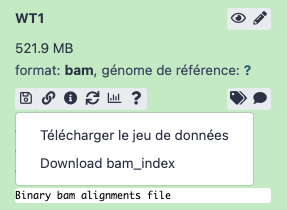

# 3. Visualisation des résultats

!!! attention "Objectif"

	Le but d'utiliser IGV c'est de vous permettre de visualiser vos résultats dans un navigateur de génome. Cet outil peut non seulement afficher le génome et son annotation mais aussi de nombreuses données basées sur leurs coordonnées génomiques.
	
La documentation d'Integrative Genomics Viewer (IGV) est [accessible en ligne](https://software.broadinstitute.org/software/igv/).

IGV se lance en ouvrant un terminal et en indiquant le chemin vers le logiciel :

`/Formation_AdG/IGV_2.11.2/igv.sh`


--------------------------------------------------------------------------------
## Récupérez vos données depuis le serveur Galaxy

Vous allez utiliser IGV en local sur votre machine. Il vous faut récupérer un certain nombre de fichier depuis votre serveur Galaxy. Pour cela vous devez cliquez sur l'icône en forme de disquette.

!!! danger "Attention"

	Pensez à choisir dans les réglages de votre navigateur la possibilité qu'il vous demande systématiquement où enregistrer le fichier. Cela vous permettra également de les renommer.


Les fichiers à télécharger sont les suivants :

- Le génome de la *drosophile* au format fasta : dmel-MAIN-chromosome-r6.18.fasta
- Le fichier d'annotation au format gtf : dmel-all-r6.18.gtf
- Les fichiers bam filtrés, triés et leurs index d'un des fichiers SF et d'un des fichiers WT : SF1.bam, SF1.bai, WT1.bam, WT1x.bai

!!! danger "Attention"

	Pour ces derniers les deux fichiers sont dans le même jeu de données. Il faut bien récupérer les deux, le jeux de données (.bam) et l'index (.bai).



Vous pouvez renommer les fichiers fasta et gtf pour leur donner des noms plus courts (exemple : dmel-r6.18.xxx). Ils seront plus lisibles dans IGV.


--------------------------------------------------------------------------------
## Importer un génome et son annotation dans IGV

Pour utiliser facilement IGV et retrouver ses données sur le long terme, il est vivement conseillé de travailler dans des sessions. Pour ouvrir une session, allez dans "File" et créer une nouvelle session en sélectionnant "New session".

Plusieurs génomes sont disponibles sur le serveur d'IGV. Si vous travaillez avec un de ces génomes, vous n'avez qu’à simplement le choisir depuis le menu "Genomes" puis dans le menu déroulant proposé par "Select Hosted Genomes".

Pour le TP, vous allez importer manuellement le génome dans IGV. Pour cela dans le menu "Genomes", vous devez choisir "Load Genome from File". Une boîte de dialogue vous demande de sélectionner le fichier fasta contenant les séquences.

Vous allez ensuite charger le fichier des annotations, décrites dans des fichiers .gff ou .gtf. Ce sont des fichiers tabulés qui associent par exemple un nom de gène à sa position dans le génome. Allez dans le menu "File", sélectionnez "Load from file" et sélectionnez le fichier d'annotation.

!!! danger "Attention"

	Il est très important de toujours choisir le fichier d’annotation qui correspond à la version du génome que vous avez utilisé pour l’alignement. Sans cela vous courrez le risque de ne pas visualiser correctement vos données. Dans notre cas on utilise les mêmes fichiers que ceux utilisés pour Galaxy.

Sauvegardez votre session.


--------------------------------------------------------------------------------
## Importer vos données

IGV vous permet de visualiser un grand nombre de types de données. À chaque type correspond un ou des formats de fichiers. Les annotations peuvent être en gff, gtf ou bed, les données quantitatives doivent être au format wig, les données d'alignement doivent être en sam ou en bam. La description précise de chacun des types de fichiers supportés est [disponible sur le site d'IGV](http://www.broadinstitute.org/software/igv/FileFormats).

Si vos fichiers sont correctement formatés, vous pouvez directement importer vos données dans votre session IGV. Il suffit d'aller dans le menu "File" et choisir "Load from File".

Les données issues de séquençage peuvent être de plusieurs types. Ce sont soit des données d'alignement soit des données de couverture. Les données d'alignement peuvent être au format sam ou bam. Dans votre arborescence, vous devez avoir des fichiers bam triés (.bam) associés à des fichiers d'index (.bai). Ce couple est nécessaire mais c'est le bam que vous chargerez, IGV s'occupant de trouver l'index .bai dans le répertoire de façon automatique.

IGV créez 2 pistes par fichier bam importé. Une des pistes concerne les données d'alignement proprement dites, la seconde concerne la couverture associée aux alignements. Elle est calculée à la volée de façon dynamique. Cette piste de couverture est indissociable de la piste d'alignement. Si vous supprimez cette piste, vous supprimez de fait la piste de couverture car le calcul ne peut plus se faire.

Si vous voulez visualiser les alignements, il vous faut zoomer sur le génomes. Vous pouvez le faire en cliquant sur le bouton "+" en haut à droite ou bien en sélectionnant à la souris une zone sur la carte des chromosomes en haut.


En effectuant un clic-droit sur une des pistes (track) vous avez accès à un grand nombre d'options de visualisation. Comme par exemple la possibilité de colorer les lectures en fonction du sens de l'alignement.


Il est aussi possible de configurer la plage de données de chacune des pistes ou de toutes les pistes. Par défaut, les pistes sont en mode Autoscale, leur minimum et maximum est adapté aux données d'une seule piste pour favoriser la visualisation des données de chaque piste individuellement.

Quand il s'agit de comparer plusieurs pistes, il peut être plus intéressant de fixer le minimum et maximum du groupe de pistes de façon à rendre la visualisation facilement comparable. Il faut pour cela sélectionner les pistes puis effectuer un clic droit sur cette sélection et choisir "Set Data Range". La boite de dialogue indique par défaut la valeur minimum de ratio pour les pistes ainsi que la valeur maximale globale et la valeur médiane. Il suffit donc de valider cette plage de données pour appliquer la même échelle à votre groupe de pistes.


--------------------------------------------------------------------------------
## Calcul de la couverture avec igvtools

La couverture s'affiche de façon dynamique, empêchant de la visualiser si le zoom n'est pas suffisant. Pour obtenir un affichage permanent nous allons charger les données de couverture. Ces données sont obtenues depuis le fichier bam trié via igvtools, qui est intégré dans IGV. Pour le lancer, allez dans le menu "Tools" puis choisir "Run igvtools".


L'exécution d'igvtool est plus ou moins longue selon la taille de votre fichier bam initial. À la fin du calcul, vous obtenez un fichier bam.tdf que vous pourrez charger dans IGV. C'est votre fichier de couverture. Depuis "File -> Load From File", vous pouvez alors importer votre ou vos fichiers bam.tdf de couverture dans IGV.
La résolution des couvertures pré-calculées est plus faible que celles calculées de façon dynamique mais on conserve tout de même une bonne partie de l'information. Il est alors possible de supprimer la piste en choisissant "Remove track" par un clic droit dans la colonne de gauche.


--------------------------------------------------------------------------------
## Sauvegarder vos données

Pour ne pas avoir à importer vos données à chaque utilisation d'IGV, il est impératif que vous n’oubliiez pas de sauvegarder votre session.

Tous vos paramètres d'échelle, de couleurs, les chemins vers les données que vous avez importées sont stockés dans votre session. C'est un fichier de type xml. Pensez à le sauver à un endroit dont vous vous rappellerez.

!!! danger "Attention"

	Ne mettez pas d'accents ou de caractères spéciaux dans les annotations que vous utiliserez, ainsi que dans votre arborescence de fichiers. IGV va enregistrer votre session en encodant vos caractères spéciaux mais ne sera plus capable de s'y retrouver quand vous souhaiterez rouvrir une session ainsi sauvegardée. 

--------------------------------------------------------------------------------
## Ressources


### Amorces de qPCR

Vous pouvez visualiser les amorces que vous avez utilisé lors de vos quantifications par qPCR dans IGV en téléchargeant le fichier [PCRprimers.gff](ressources/PCRprimers.gff).


### Locus de piRNA

Séquences fasta des piRNA clusters et du transgene lacZ cible.

```
https://psilo.sorbonne-universite.fr/index.php/s/AG_Ressources/download?path=%2F&files=20A.fasta
https://psilo.sorbonne-universite.fr/index.php/s/AG_Ressources/download?path=%2F&files=38C_1.fasta
https://psilo.sorbonne-universite.fr/index.php/s/AG_Ressources/download?path=%2F&files=38C_2.fasta
https://psilo.sorbonne-universite.fr/index.php/s/AG_Ressources/download?path=%2F&files=38C_3.fasta
https://psilo.sorbonne-universite.fr/index.php/s/AG_Ressources/download?path=%2F&files=42AB.fasta
https://psilo.sorbonne-universite.fr/index.php/s/AG_Ressources/download?path=%2F&files=80F.fasta
https://psilo.sorbonne-universite.fr/index.php/s/AG_Ressources/download?path=%2F&files=flamenco.fasta 
https://psilo.sorbonne-universite.fr/index.php/s/AG_Ressources/download?path=%2F&files=PA92_TransgeneCible.fasta
```

Vous pouvez récupérer les coordonnées génomiques des piARN stockés sur la [piRNAdb](https://www.pirnadb.org/download/archive/gff_gtf) aux formats GTF et GFF.

