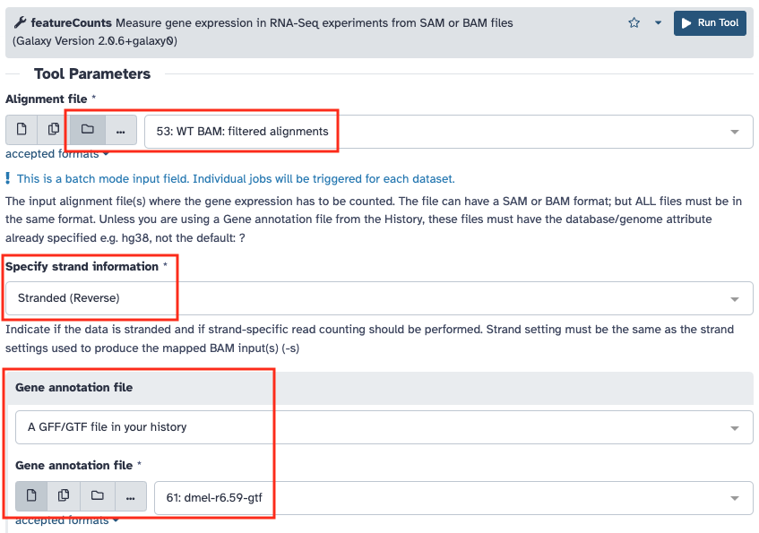

# 2. Traitement des données de RNA-seq

!!! danger "Compte rendu des résultats"

	Je vous demande de m'envoyer en message direct dans Slack à la fin de la scéance le cahier de manipulation électronique (fichier texte) dans lequel sont décrites les étapes que vous avez effectuées. L’objectif est que la personne qui va relire ce document soit capable de reproduire ce que vous avez fait et obtenir les mêmes résultats que vous.

!!! attention "Objectif"

	Le but de cette séance de Travaux Pratiques, est de regarder l’expression différentielle des transcrits en contexte mutant.

!!! hint ""

	Les questions posées tout au long de cette page sont là pour vous guider dans votre analyse, pour vous aider à comprendre ce que vous faites et ainsi mieux appréhender vos résultats. Elles ne sont en aucun cas la base de l’évaluation de votre travail.

Vous allez partir de l'historique que vous avez créé mardi où se trouve les deux  collections des données de séquençage des ARN WT et SF ([voir le tutoriel](https://artbio.github.io/startbio/AnalyseGenomes_2022/Loading_data_in_galaxy/#5-dataset-collections)).

--------------------------------------------------------------------------------
## Contrôle qualité des lectures

Comme dans la partie sur les [petits ARN](./srna.md#controle-qualite-des-lectures), regardez les résultats du contrôle de qualité effectué par FastQC sur les fichiers fastq pour les 2 collections.

!!! hint "Questions"

	- Combien de lectures avez-vous dans vos fichiers ?
	- Quelle est la version du format fastq utilisée ?
	- Les lectures sont-elles de bonne qualité pour poursuivre vos analyses ?
	- Pouvez-vous observer des biais particuliers à prendre en compte pour la suite ?

--------------------------------------------------------------------------------
## Alignement des lectures sur le génome de la drosophile

Vous allez utiliser bowtie pour réaliser l’alignement des lectures obtenues sur le génome de la drosophile mais le but ici est d’obtenir plus de lectures qui s’alignent car les fragments sont plus longs que pour les petits ARN.

!!! hint "Question"

	- Quels sont les paramètres et les options que vous allez choisir ?

Une fois que vous avez déterminé les options à utiliser dans votre ligne de commande, lancez l’alignement de votre fichier fastq. Nous allons utiliser l’outil ***Map with Bowtie for Illumina*** sur les données brutes en alignant les lectures sur le génome de référence de la drosophile.

En cas de soucis d'affichage des données en entrée de l'outil Bowtie, reportez vous aux [annexes](./annexes.md) pour savoir comment changer le type des données.

!!! hint "Questions"

	- Combien d’alignements avez-vous trouvés ?
	- Combien de lectures n’ont pas été alignées ?

--------------------------------------------------------------------------------
## Conversion des fichiers SAM

Vous allez effectuer la conversion des fichiers SAM en BAM en éliminant les lectures qui ne se sont pas alignées, puis trier les alignements suivant les coordonnées chromosomiques du génome de référence.

D'abord il faut récupérer le fasta du génome de la *drosophile* dans l'historique actuel. Reportez vous aux [annexes](./annexes.md) pour savoir comment copier les données entre historiques.

Vous allez ensuite convertir le SAM en BAM et trier le fichier BAM en utilisant l’outil ***SAM-to-BAM***.

<!---
Puis enfin le filtrage pour supprimer du fichier BAM les lectures qui n’ont pas été alignées et ainsi réduire la taille du fichier. Pour cela on utilise l’outil ***FilterSamReads***.

-->

Puis enfin le filtrage pour supprimer du fichier BAM les lectures qui n’ont pas été alignées et ainsi réduire la taille du fichier. Pour cela on utilise l’outil ***Filter SAM or BAM***.

--------------------------------------------------------------------------------
## Mesure des niveaux d'expression

Afin de déterminer la couverture en lectures de chacun des gènes de la drosophile, vous allez utiliser l’outil **featureCounts** dont la [documentation est disponible en ligne](https://www.rdocumentation.org/packages/Rsubread/versions/1.22.2/topics/featureCounts).

Mais avant vous devez copier le fichier d’annotation du génome de la Drosophile (dmel-all-r6.18.gtf) depuis l'historique "References" comme précédemment.

!!! note "Le format GFF"

	Le format GFF est un format de fichier standard utilisé pour stocker les informations d’annotation d’un génome dans un fichier texte. GFF signifie Generic Feature Format. Les fichiers GFF sont des fichiers tabulés de 9 colonnes contenant du texte simple. [Les spécifications détaillées de ce format sont disponibles en ligne](https://github.com/The-Sequence-Ontology/Specifications/blob/master/gff3.md).

Le décompte des alignements va se faire sur le fichier BAM filtré et trié que vous avez généré à l’étape précédente. Pour cela vous utiliserez l’outil ***featureCounts*** installé dans Galaxy en sélectionnant "Stranded (Forward)". 

!!! hint "Questions"

	- Quel est le pourcentage des éléments dont le comptage est à 0 ?
	- Quelle est la distribution des mesures de couverture obtenue ?
	- Mesurez la moyenne, la médiane et les quartiles de cette distribution ?

--------------------------------------------------------------------------------
## Analyse différentielle

Vous allez maintenant comparer les niveaux d’expression des gènes entre vos 2 conditions à l’aide des 3 réplicats de chaque condition. Pour cela vous devez d’abord récupérer les fichiers de comptage des autres échantillons qu’il vous manque.

Reportez vous aux [annexes](./annexes.md) pour savoir comment partager des données entre serveurs Galaxy.

Ensuite vous allez utiliser l’outil ***DESeq2*** pour effectuer l’analyse différentielle. Il se base sur le [package R DESeq2](http://bioconductor.org/packages/release/bioc/html/DESeq2.html).

Vous devez indiquer à l’outil quels sont les échantillons à rattacher à chaque condition (facteur), puis lancer l’analyse.

!!! hint "Questions"

	- Quel est le nombre de gènes différentiellement exprimés que vous obtenez ?
	- L’étape d’analyse différentielle s’est elle bien déroulée ?

Pour aller plus loin dans la visualisation vous allez réaliser un volcano plot sur vos résultats grâce à l'outil ***Volcano Plot***.
Attention à bien faire correspondre les colonnes demandées au format de sortie de DESeq2.

Un [tutoriel](https://training.galaxyproject.org/training-material/topics/transcriptomics/tutorials/rna-seq-viz-with-volcanoplot/tutorial.html) très bien fait vous permet d'aller plus loin avec cet outil.
